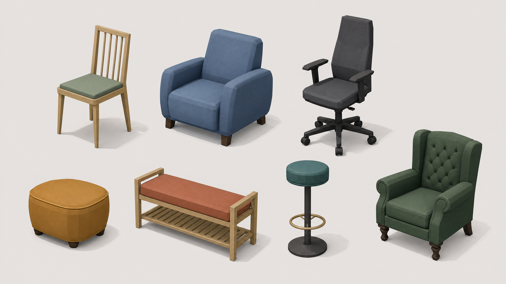

# PROD-012 — Distinct furniture visual families

**Статус:** Completed
**Дата:** 15 августа 2026 г.
**Связанное решение:** [ADR-018](../adr/adr-018-data-driven-furniture-visual-families.md)

## Пользовательский результат

Предметы больше не получают один generic mesh только потому, что они имеют общий `type`. В частности, Modern dining chair, Comfort lounge armchair, office chair, ottoman, entry bench, bar stool и classic armchair теперь имеют самостоятельные low-poly silhouette. Угловой диван читается как L-sectional с chaise, а прямой — как симметричный трёхместный sofa. Computer desk, sideboard, media console и nightstand likewise obtain visual roles, которые можно распознать до чтения названия карточки.

| Family group | Authored V1 visual families | Обязательные видимые cues |
|---|---|---|
| Seating | `diningChair`, `loungeArmchair`, `officeChair`, `ottoman`, `entryBench`, `barStool`, `classicArmchair` | Different base/leg system, arm and back massing, seat height, upholstery/wood/metal blocks. |
| Sofas | `sectionalSofa`, `straightSofa` | L-plan chaise and asymmetric cushions vs. straight three-cushion symmetric plan. |
| Work/storage | `computerDesk`, `sideboard`, `mediaConsole`, `nightstand` | Monitor shelf/cable channel; low long doors/feet; media bay/cable slots; compact drawer/pull. |

## Контракт и границы

`data/visuals/item-visuals.json` is now **version 3**. Priority catalog IDs carry explicit `shape` and `visualFamily` mappings. `ItemVisualFactory` resolves them to deterministic Three.js primitives and exports the selected family in `group.userData.visualFamily`.

> A visual family is Presentation policy. It never changes `dimensions`, `InteractionProfile`, item type, level availability, score, progression or economy.

The red/green suite asserts every priority family and a unique named-part signature. Named parts create objective silhouette contracts—such as `office-spoke` and `office-wheel`, `sectional-chaise`, `classic-tuft`, `monitor-shelf`, `media-bay` and `nightstand-drawer`—without coupling gameplay tests to screenshot pixels.

## Acceptance evidence

The generated reference establishes the production low-poly language: warm matte material blocks, restrained contemporary palette, orthographic/isometric readability and sharply distinct furniture silhouettes. It is an art-direction reference only; no generated image is inserted into the runtime.

Live browser smoke placed `sofa-001`, `sofa-002`, `chair-001` and `chair-002` into level 001. The sectional chaise and straight sofa remained distinguishable from the game camera, and the narrow three-slat dining chair differed clearly from the broad upholstered lounge armchair. The temporary smoke room was reset to zero items with no evaluation, completion or progression change. Unit contracts cover priority families not present in the current three level catalogs.

## Non-goals

PROD-012 does not introduce external GLB models, texture downloads, item customisation, new catalog items, new placement rules or gameplay semantics. Furniture art direction is complete at the deterministic low-poly primitive layer; future art asset work must remain a separate slice.
