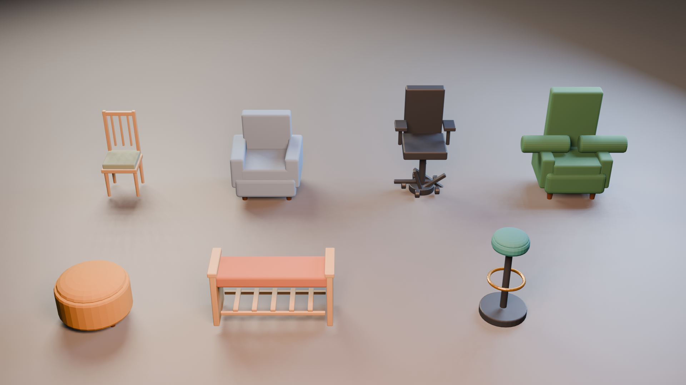

# PROD-012R — Asset-backed furniture quality

**Статус:** Completed
**Дата:** 15 августа 2026 г.
**Связанное решение:** [ADR-019](../adr/adr-019-asset-backed-furniture-presentation.md)

## Цель

PROD-012 established family-level visual semantics but did not meet the required furniture rendering quality. PROD-012R replaces its priority seating runtime geometry with authored GLB prefabs. The change is strictly presentation-only: all item dimensions, `InteractionProfile`, score, progression and economy remain unchanged.

## Поставленный pack

| Item | Runtime prefab | Primary visual treatment | Byte budget |
|---|---|---|---:|
| `chair-001` | `dining-chair-v1.glb` | Tapered oak legs, padded seat, three slats | 225 KB |
| `chair-002` | `lounge-armchair-v1.glb` | Wide upholstered arms, low seat, separate back cushion | 175 KB |
| `chair-003` | `office-chair-v1.glb` | Gas lift, five-spoke base, wheels, armrests | 375 KB |
| `ottoman-001` | `ottoman-v1.glb` | Domed upholstery, piping, low feet | 225 KB |
| `bench-001` | `entry-bench-v1.glb` | Upholstered bench, framed sides, slatted shelf | 325 KB |
| `barstool-001` | `barstool-v1.glb` | Weighted base, central column, brass footrest | 325 KB |
| `armchair-001` | `classic-armchair-v1.glb` | High back, rolled arms, tuft buttons, carved feet | 750 KB |

The measured pack payload is **1,889,856 bytes**, within the manifest’s **2,500,000-byte** ceiling. Every GLB carries a valid binary header and is declared in `data/visuals/furniture-assets.v1.json` with schema version 1.

## Pipeline and architecture

`tools/create_seating_assets.py` is the reproducible headless Blender authoring source. It uses a semantic Three.js-compatible coordinate convention at its boundary, applies bevelled low/mid-poly construction and exports Y-up GLB. `tools/render_seating_asset_preview.py` produces the shared visual inspection render.

At runtime, `FurnitureAssetRepository` maps catalog item ID to a cached source prefab, then returns a material-isolated clone for each placed instance. `RoomView` renders an immediate procedural visual for input responsiveness and upgrades it asynchronously when the prefab is ready. `ItemVisualFactory.attachAsset()` hides only the fallback meshes and retains the same selection halo, ghost validity behaviour and compatibility fallback. A failed asset request retains the fallback instead of breaking placement.

> Presentation owns visual source selection. The Domain never sees a GLB path or performs an asset decision.

## Acceptance evidence

The GLB pack was inspected in a controlled render against the approved seating art direction. Browser smoke placed the asset-backed dining chair and lounge armchair in level 001. Both loaded without GLTF parsing/material console errors, remained inside their existing gameplay footprints and were visibly distinguishable in the actual game camera. The temporary smoke room was reset to zero items without evaluation or progression changes.

## Non-goals

This slice does not replace sofa, table or storage visuals, introduce external downloads, make items configurable, alter client briefs, or deliver a full photorealistic material system. These GLBs establish the reusable production asset pipeline; future packs use the same manifest, budget and fallback rules.
