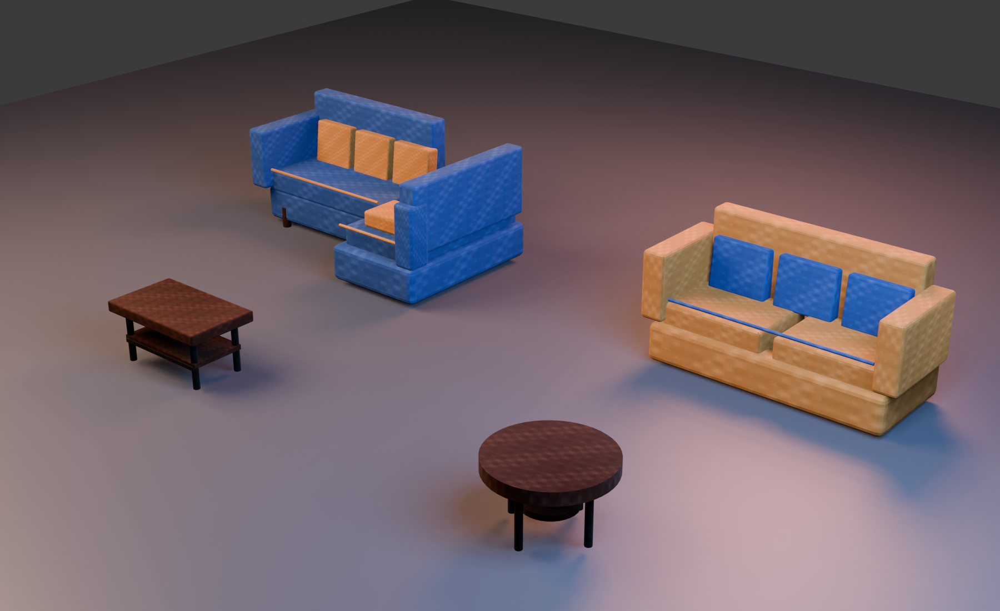
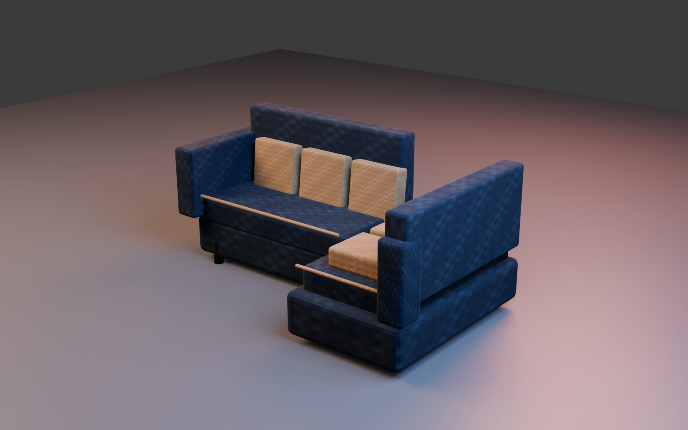

# PROD-013 — Asset-backed PBR lounge pack

**Статус:** Completed

**Дата:** 15 августа 2026 г.

**Связанное решение:** [ADR-020](../adr/adr-020-pbr-texture-baking-pipeline.md)

## Цель

PROD-012R установил versioned GLB delivery и graceful runtime fallback для priority seating, однако sofas и coffee tables всё ещё не предоставляли material response, достаточный для дальнейшей production art direction. PROD-013 переносит четыре lounge предмета на **asset-backed PBR** presentation: сохранены существующие gameplay IDs, footprints, interaction semantics, scoring, progression и persistence, а визуальная реализация получает embedded base color, tangent-space normal, packed metallic-roughness и AO.

## Поставленный pack

| Catalog item | Runtime prefab | Авторская визуальная семья | Payload | Manifest ceiling |
|---|---|---|---:|---:|
| `sofa-001` | `sectional-hero-pbr-v1.glb` | L-shaped sectional: navy upholstery, ochre cushions and dark-wood legs | 947,000 B | 1,700,000 B |
| `sofa-002` | `straight-sofa-pbr-v1.glb` | Straight cream sofa with contrasting navy cushions | 808,056 B | 1,300,000 B |
| `table-002` | `coffee-table-pbr-v1.glb` | Rectangular dark-wood coffee table with lower shelf and black metal legs | 524,048 B | 800,000 B |
| `coffeetable-001` | `round-coffee-table-pbr-v1.glb` | Round dark-wood coffee table with brass inlay, shelf and black metal legs | 539,796 B | 800,000 B |

The measured pack is **2,818,900 bytes**, leaving 1,981,100 bytes below the versioned **4,800,000-byte** pack ceiling declared in [`lounge-pbr-assets.v1.json`](../../data/visuals/lounge-pbr-assets.v1.json). Every manifest entry requires `baseColor`, `normal`, `roughness` and `ambientOcclusion`; the asset inspection contract validates that each referenced GLB provides those material bindings.

## Pipeline and architecture

[`tools/create_lounge_pbr_assets.py`](../../tools/create_lounge_pbr_assets.py) is the reproducible Blender authoring source. It creates UV0 for base color, normal and packed ORM textures, and UV1 for AO. The workflow bakes or authors high-to-low normal and material passes, packs AO/roughness/metallic into ORM, and then [`tools/add_gltf_ao_binding.mjs`](../../tools/add_gltf_ao_binding.mjs) maps the packed texture’s red channel as `occlusionTexture` on UV1 in the exported GLB.

`FurnitureAssetRepository` now accepts multiple versioned manifests and merges their item mappings without allowing the lounge pack to replace the existing seating pack. `main.js` composes the seating and lounge manifests. `RoomView` owns a PMREM-generated `RoomEnvironment`, so Three.js PBR materials receive a stable environment response and the PMREM resources are released on view disposal.

> The asset pack is a **Presentation-only** substitution. The Domain does not import Three.js, GLB metadata, texture URLs or lighting state, and gameplay semantics remain sourced from versioned content contracts rather than render model geometry.

## TDD and acceptance evidence

| Evidence | Result |
|---|---|
| `LoungePbrAssetManifest` contract | Validated schema ownership, each required PBR binding and the pack byte ceiling. |
| `FurnitureAssetRepository` contract | Validated multi-manifest merge, cache isolation and existing fallback behaviour. |
| `PbrEnvironmentWiring` contract | Validated PMREM `RoomEnvironment` wiring and deterministic dispose lifecycle. |
| Production quality gate | `npm test` passed **112 files / 384 tests**; `npm run build`, `npm audit --omit=dev --audit-level=high` and `git diff --check` completed successfully, with zero reported production dependency vulnerabilities. |
| Controlled studio inspection | `render_lounge_pack_preview.py` imported all four production GLBs. The final preview shows legible separate silhouettes, upholstery/wood/metal contrast, visible fabric detail and no missing textures, broken normals or collapsed geometry. |
| Browser smoke | A normal catalog placement loaded `sofa-001` and `table-002` at their existing gameplay footprints without material/parser console failures; the room was reset to zero temporary items without evaluation or progression changes. |

The hero sectional calibration render is retained as additional asset evidence below.

## Non-goals

This slice does not modify client briefs, style scoring, functional-layout rules, collision geometry, gameplay dimensions, the seating pack, or any persistence contract. It does not claim a universal physically accurate material library; the versioned bake workflow is the production baseline for the next dining/table, storage and lighting packs, each of which requires its own red contract, asset budget and visual acceptance.

## References

[1]: ../../data/visuals/lounge-pbr-assets.v1.json "Lounge PBR asset manifest v1"
[2]: ../../tests/Infrastructure/LoungePbrAssetManifest.test.js "Lounge PBR manifest contract"
[3]: ../../tests/Presentation/FurnitureAssetRepository.test.js "Furniture asset repository contract"
[4]: ../../tests/Presentation/PbrEnvironmentWiring.test.js "PMREM environment wiring contract"
