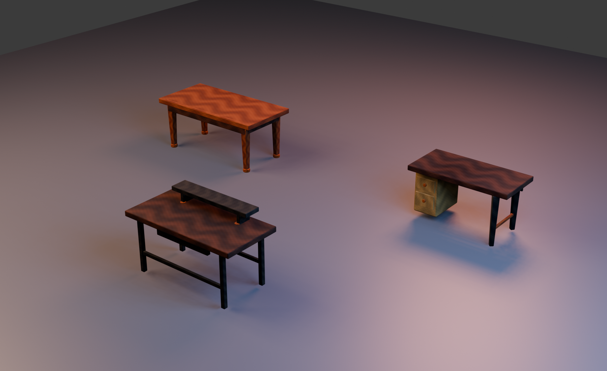

# PROD-014 — Asset-backed PBR dining/table pack

**Статус:** Completed

**Дата:** 15 августа 2026 г.

**Связанное решение:** [ADR-021](../adr/adr-021-pbr-asset-manifest-conformance.md)

## Цель

PROD-013 proved the production PBR workflow for lounge seating and coffee tables. PROD-014 applies that workflow to every remaining table-type catalog asset that was still procedural: the dining table, writing desk and computer desk. The slice is strictly presentation-only: catalogue IDs, dimensions, `InteractionProfile`, room placement semantics, ergonomics, scoring, progression and persistence remain unchanged.

## Поставленный pack

| Catalog item | Existing gameplay footprint | Runtime prefab | Авторская визуальная семья | Payload | Per-asset ceiling |
|---|---:|---|---|---:|---:|
| `table-001` | 1.8 × 0.9 m | `dining-table-pbr-v1.glb` | Amber-oak dining table with dark apron, tapered legs and brass details | 1,004,352 B | 1,400,000 B |
| `desk-001` | 1.4 × 0.7 m | `writing-desk-pbr-v1.glb` | Walnut writing desk with asymmetric cream drawer pedestal, graphite support and brass stretcher | 1,154,076 B | 1,400,000 B |
| `table-003` | 1.6 × 0.8 m | `computer-desk-pbr-v1.glb` | Walnut workstation with raised monitor shelf, cable tray, graphite frame and brass grommets | 1,014,748 B | 1,400,000 B |

The measured pack is **3,173,176 bytes**, leaving **426,824 bytes** below the versioned **3,600,000-byte** ceiling in [`dining-table-pbr-assets.v1.json`](../../data/visuals/dining-table-pbr-assets.v1.json). Each entry declares the embedded PNG texture variant, `basecolor-normal-orm` texture set, `requiresUv1: true`, and normal/roughness/AO expectations.

## Pipeline and architecture

[`tools/create_dining_table_pbr_assets.py`](../../tools/create_dining_table_pbr_assets.py) is the reproducible Blender source. It authors material-specific base color, tangent-space normal and packed ORM textures, prepares UV0 plus an AO UV1 set for every render mesh, and exports Y-up GLB assets. [`tools/add_gltf_ao_binding.mjs`](../../tools/add_gltf_ao_binding.mjs) then binds the ORM red channel as glTF `occlusionTexture` on UV1.

The existing multi-manifest `FurnitureAssetRepository` needs no gameplay or loader policy change. `main.js` supplies the new dining/table manifest alongside the seating and lounge manifests, so cached, material-isolated GLB clones upgrade the immediate procedural visual asynchronously. The fallback visual persists if asset delivery fails.

> Rendering fidelity is not a gameplay input. Domain and Application remain independent from GLB paths, PBR maps, UV layers, PMREM lighting and any render failure state.

## TDD and acceptance evidence

| Evidence | Result |
|---|---|
| `DiningTablePbrAssetManifest` red contract | Initially failed because the versioned manifest did not exist; it now validates asset ownership, PBR map bindings, `TEXCOORD_0`/`TEXCOORD_1`, occlusion UV1 binding and pack budgets. |
| `DiningTableAssetWiring` red contract | Initially failed because the composition root did not import the dining/table manifest; it now validates the manifest’s Presentation-only multi-pack wiring. |
| GLB inspection | All three GLBs expose embedded base color, normal, metallic-roughness and ambient-occlusion bindings. |
| Production quality gate | `npm test` passed **114 files / 387 tests**; `npm run build`, `npm audit --omit=dev --audit-level=high` and `git diff --check` completed successfully, with zero reported production dependency vulnerabilities. |
| Controlled studio inspection | The final preview shows three recognisably distinct furniture families; amber oak, walnut, cream lacquer, graphite metal and brass remain visible under opposing warm/cool lighting. No missing texture, collapsed mesh or broken normal is visible. |
| Browser smoke | Normal catalog placement loaded `table-001` at its existing 1.8 × 0.9 m footprint and `desk-001` at 1.4 × 0.7 m without parser/material errors. A standard New Attempt reset returned the room to zero temporary items without evaluation or progression changes. |

## Non-goals

This slice does not add a new table catalogue item, alter functional dining scoring, change the existing chair pack, introduce KTX2 texture transcoding, modify storage or lighting assets, or make render model geometry authoritative for placement. Storage is the next catalog family to move through the same versioned PBR pipeline.

## References

[1]: ../../data/visuals/dining-table-pbr-assets.v1.json "Dining/table PBR asset manifest v1"
[2]: ../../tests/Infrastructure/DiningTablePbrAssetManifest.test.js "Dining/table PBR manifest contract"
[3]: ../../tests/Presentation/DiningTableAssetWiring.test.js "Dining/table composition-root wiring contract"
[4]: ../../tools/create_dining_table_pbr_assets.py "Reproducible dining/table PBR authoring script"
