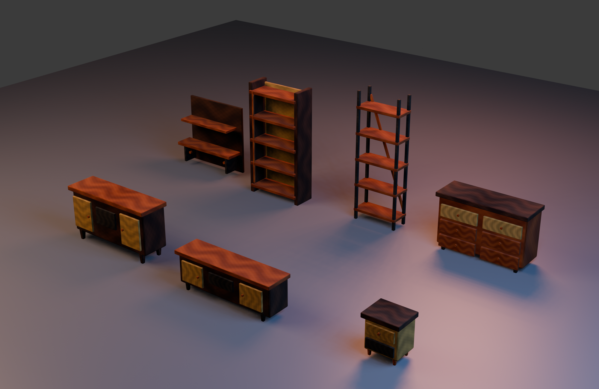

# PROD-015 — Asset-backed PBR storage pack

**Статус:** Completed

**Дата:** 15 августа 2026 г.

**Связанное решение:** [ADR-022](../adr/adr-022-catalog-family-asset-pack-completeness.md)

## Цель

PROD-015 переводит весь оставшийся catalog family `storage` с procedural rendering на authored PBR GLB prefabs. В pack входят настенная полка, книжный шкаф, комод, высокий стеллаж, буфет, тумба под ТВ и прикроватная тумба. Слайс не меняет item IDs, gameplay dimensions, `InteractionProfile`, storage score, constraints, persistence, unlocks или progression: GLB является только асинхронным presentation upgrade поверх прежней безопасной procedural geometry.

## Поставленный pack

| Catalog item | Existing gameplay footprint | Runtime prefab | Авторская визуальная семья | Payload | Per-asset ceiling |
|---|---:|---|---|---:|---:|
| `shelf-001` | 1.2 × 0.3 m | `wall-shelf-pbr-v1.glb` | Wall shelf with tall walnut back, honey-oak boards, graphite brackets and brass hooks | 672,232 B | 1,250,000 B |
| `shelf-002` | 1.0 × 0.4 m | `bookcase-pbr-v1.glb` | Enclosed multi-shelf bookcase with warm back panel and brass side rail | 722,388 B | 1,250,000 B |
| `cabinet-001` | 1.4 × 0.5 m | `drawer-chest-pbr-v1.glb` | Six-drawer chest with walnut top, articulated fronts, brass pulls and graphite legs | 1,039,420 B | 1,250,000 B |
| `shelf-003` | 0.8 × 0.35 m | `tall-rack-pbr-v1.glb` | Open tall rack with graphite frame, oak shelves and diagonal brass brace | 613,148 B | 1,250,000 B |
| `sideboard-001` | 1.5 × 0.45 m | `sideboard-pbr-v1.glb` | Mid-century sideboard with central open bay, cream doors and tapered legs | 892,204 B | 1,250,000 B |
| `tvstand-001` | 1.6 × 0.4 m | `tv-stand-pbr-v1.glb` | Low media stand with centered open bay, twin doors and graphite legs | 893,484 B | 1,250,000 B |
| `nightstand-001` | 0.5 × 0.4 m | `nightstand-pbr-v1.glb` | Compact lacquer-and-walnut nightstand with drawer, cubby and brass feet | 720,796 B | 1,250,000 B |

The measured pack is **5,553,672 bytes**, leaving **1,046,328 bytes** below the versioned **6,600,000-byte** ceiling in [`storage-pbr-assets.v1.json`](../../data/visuals/storage-pbr-assets.v1.json). Every entry declares `basecolor-normal-orm`, the embedded PNG review variant and `requiresUv1: true`.

## Pipeline and architecture

[`tools/create_storage_pbr_assets.py`](../../tools/create_storage_pbr_assets.py) deterministically authors the seven models, their readable construction details and packed PBR textures. All render meshes receive UV0 plus AO-safe UV1. The reusable [`tools/add_gltf_ao_binding.mjs`](../../tools/add_gltf_ao_binding.mjs) binds ORM red as the glTF occlusion texture using UV1.

The existing multi-manifest `FurnitureAssetRepository` is unchanged. The composition root imports the storage manifest alongside seating, lounge and dining/table packs; it continues to cache a source GLB, return material-isolated clones and retain fallback visuals when delivery fails. The pack remains entirely in Presentation content.

> Render fidelity is not a gameplay input. Domain and Application remain independent from GLB paths, texture maps, UV layers, PMREM lighting and asset delivery failure state.

## TDD and acceptance evidence

| Evidence | Result |
|---|---|
| `StoragePbrAssetManifest` red contract | Initially failed because the storage manifest did not exist. It now validates all seven catalog mappings, byte ceilings, embedded PBR maps, UV0/UV1 and occlusion UV1 binding. |
| `StorageAssetWiring` red contract | Initially failed because the composition root did not import the storage manifest. It now validates the fourth Presentation-only multi-pack source. |
| GLB inspection | All seven GLBs expose embedded base color, normal, metallic-roughness and ambient-occlusion bindings. |
| Production quality gate | `npm test` passed **116 files / 390 tests**; `npm run build`, `npm audit --omit=dev --audit-level=high` and `git diff --check` completed successfully, with zero reported production dependency vulnerabilities. |
| Controlled studio inspection | The final preview confirms distinguishable wall shelf, enclosed bookcase, tall rack, chest, sideboard, TV stand and nightstand silhouettes, while wood, lacquer, graphite and brass remain separately legible under warm/cool lighting. |
| Browser smoke | Normal catalog flow placed `cabinet-001` at its existing 1.4 × 0.5 m footprint and `shelf-002` at 1.0 × 0.4 m without parser/material errors. Standard New Attempt restored zero room items without evaluation or progression changes. |

## Non-goals

This slice does not add a storage catalog item, introduce wall-attachment gameplay, change storage scoring or persistence, alter media functionality, package KTX2 textures, or modify lighting assets. The next PBR catalog family is lighting: table lamp, floor lamp and ceiling fixture.

## References

[1]: ../../data/visuals/storage-pbr-assets.v1.json "Storage PBR asset manifest v1"
[2]: ../../tests/Infrastructure/StoragePbrAssetManifest.test.js "Storage PBR manifest contract"
[3]: ../../tests/Presentation/StorageAssetWiring.test.js "Storage composition-root wiring contract"
[4]: ../../tools/create_storage_pbr_assets.py "Reproducible storage PBR authoring script"
