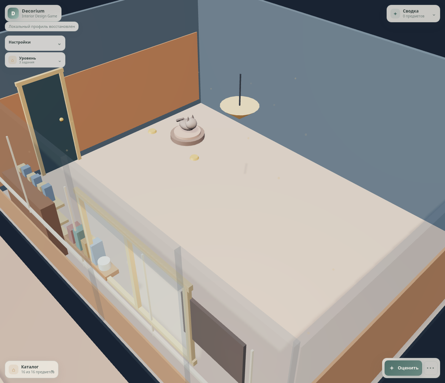
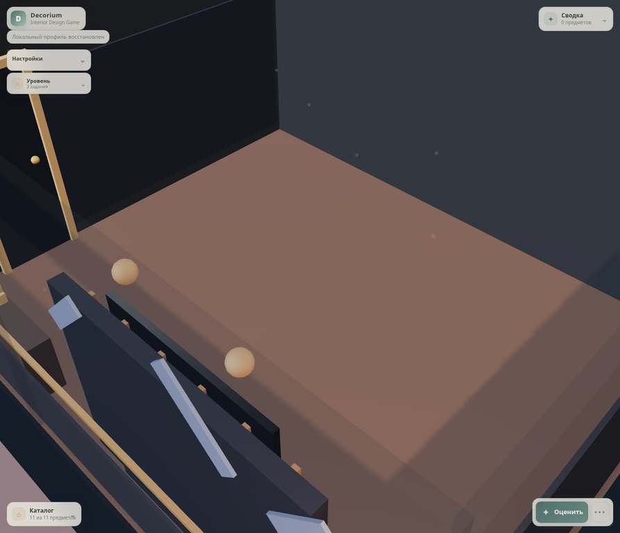
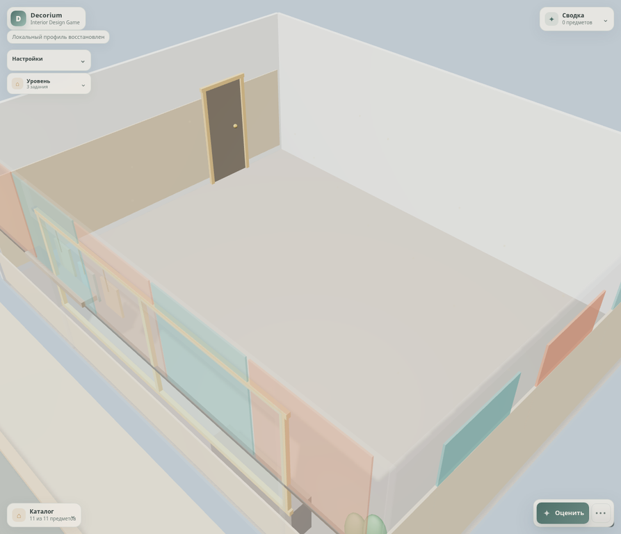

# PROD-016 — Authored room identity baseline

**Статус:** Completed

**Дата:** 15 августа 2026 г.

**Связанное решение:** [ADR-023](../adr/adr-023-versioned-room-identity-selectors.md)

## Цель

PROD-016 превращает три текущих presentation profiles из вариаций floor/wall colour и lighting в различимые авторские пространства. Слайс вводит versioned selectors для wall treatment, non-semantic built-in décor и exterior composition. Он намеренно не меняет размер комнаты, item IDs, catalog, placement, score, ergonomics, unlocks, progression или persistence.

> Room identity — это Presentation content. Она должна улучшать визуальное считывание брифа и пространства, но не создавать неявный deterministic gameplay input.

## Поставленные profile-owned environments

| Level / profile | Wall treatment | Built-in landmark | Exterior composition | Gameplay boundary |
|---|---|---|---|---|
| `level-001` / `warm-starter-living` | `warm-linen-wainscot`: тёплая нижняя деревянная панель, вертикальные рейки и мягкая текстильная палитра | `living-library-nook`: библиотечная ниша с полками, книгами и подвесным светильником | `residential-porch`: навес, стойки и planter zone | Existing cat bed, bowls and movable ambient fixtures remain Presentation-only. |
| `level-002` / `urban-media-corner` | `midnight-graphic-wallpaper`: тёмная графическая surface treatment с упорядоченными luminous motifs | `media-wall-screen`: slatted media wall, decorative screen, console and sconces | `urban-cinema-block`: marquee, exterior screen, banners and bulbs | Decorative screen is explicitly `semantic: false`; player must still place `tv-001` to satisfy the authored `view-target` rule. |
| `level-003` / `bright-studio` | `sunwash-gallery-wall`: contrast-calibrated teal/terracotta gallery panels and rail | `studio-gallery-rail`: hanging frames and workbench | `courtyard-workshop`: courtyard arch, benches and planted work area | No catalog or studio functional rules were modified. |

## Versioned content contract

[`environment-profile.v2.schema.json`](../../data/presentation/environment-profile.v2.schema.json) and [`environment-profiles.v2.json`](../../data/presentation/environment-profiles.v2.json) replace runtime use of the v1 presentation catalog. Every profile carries a `room.identity` object with exactly three closed, reviewable selectors:

```json
{
  "wallTreatmentPreset": "midnight-graphic-wallpaper",
  "builtInPreset": "media-wall-screen",
  "exteriorCompositionPreset": "urban-cinema-block"
}
```

`EnvironmentProfilePlan` resolves the selectors into immutable presentation values. `RoomView` owns wall treatment geometry and scene disposal at rebuild. `LocationEnvironmentSystem` owns the authored built-ins and exterior compositions. The Domain, Application scoring/use-case layers and item catalog do not import or interpret these selectors.

## TDD and verification

| Evidence | Result |
|---|---|
| `RoomIdentityEnvironmentContent` red contract | Initially failed because the v2 schema/catalog did not exist. It now validates all three exact profile identities, schema version and semantic-TV guardrail. |
| `RoomIdentityProfilePlan` red contract | Initially failed because the Presentation plan exposed no `identity`. It now resolves immutable wall, built-in and exterior composition presets. |
| Existing regression migration | Legacy environment repository, static asset, wiring, profile-plan and fixture interaction contracts were migrated to the active v2 catalog protocol. |
| Production quality gate | `npm test` passed **118 files / 393 tests**; `npm run build`, `npm audit --omit=dev --audit-level=high` and `git diff --check` completed successfully, with zero reported production dependency vulnerabilities. |
| Real-game visual acceptance | Level 001 was inspected with the clean player profile. Levels 002 and 003 were inspected through a reversible valid local preview fixture; no placement or evaluation occurred and the original profile was restored exactly afterwards. |

## Visual evidence

| Warm starter living | Urban media corner | Bright studio |
|---|---|---|
|  |  |  |

The accepted views demonstrate a warm library/residential read, a darker media/cinema read and a bright teal/terracotta studio-gallery read from the actual game camera. The studio panel contrast was calibrated after the first view proved too close to a generic white shell.

## Non-goals and follow-up

This baseline does not introduce an implicit functional television, new room topology, wall placement mechanics, scoring effects, player interaction with built-ins, or a new animal behavior system. The immediate follow-up is an **ambient life and animal behavior** slice: versioned pedestrian/animal route variants and stateful but deterministic cat behavior. That work must preserve the same Presentation-only boundary and explicit performance budgets.

## References

[1]: ../../data/presentation/environment-profile.v2.schema.json "Presentation environment profile v2 schema"
[2]: ../../data/presentation/environment-profiles.v2.json "Authored room identity profiles"
[3]: ../../tests/Infrastructure/RoomIdentityEnvironmentContent.test.js "PROD-016 room identity content contract"
[4]: ../../tests/Presentation/RoomIdentityProfilePlan.test.js "PROD-016 profile plan contract"
[5]: ../adr/adr-023-versioned-room-identity-selectors.md "ADR-023"
