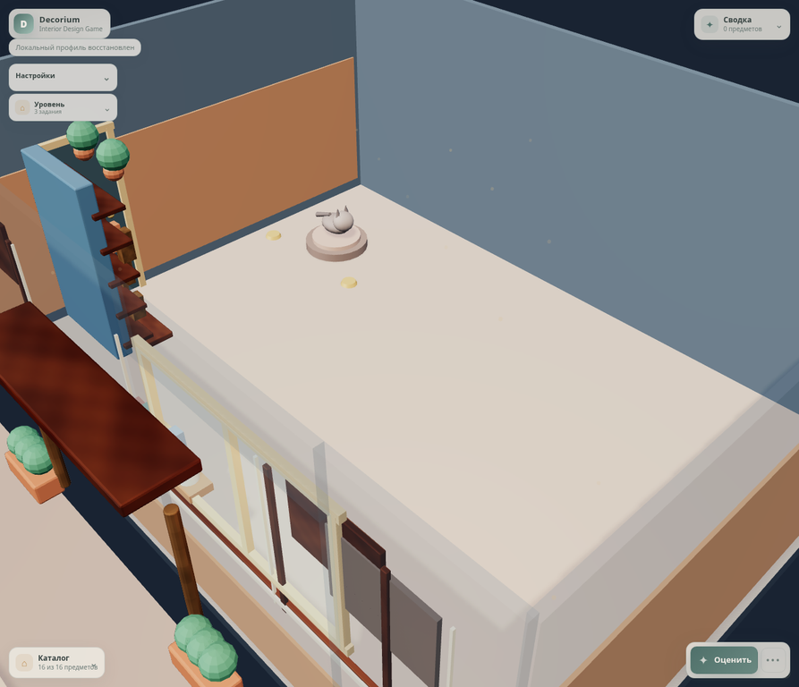
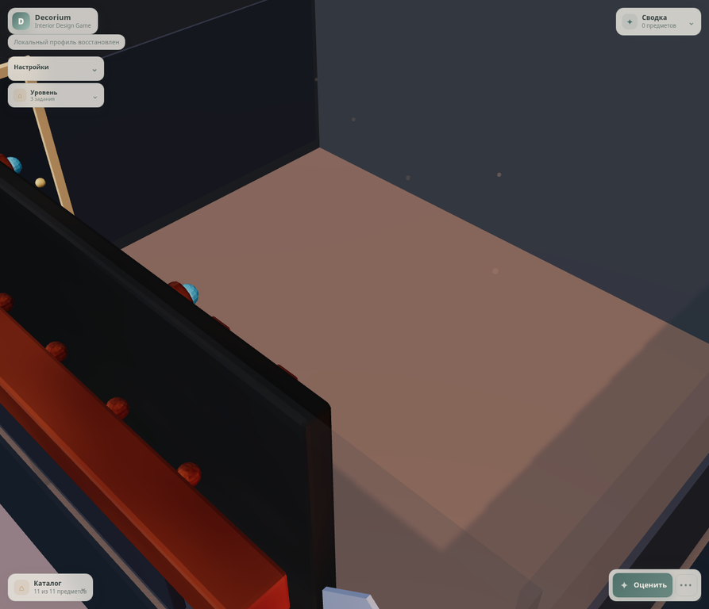
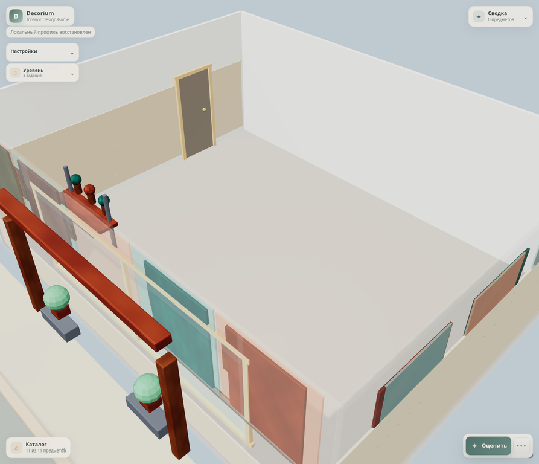

# PROD-017 — Asset-backed PBR room composition pack

**Статус:** Completed

**Дата:** 15 августа 2026 г.

**Связанное решение:** [ADR-024](../adr/adr-024-room-composition-asset-backed-environment.md)

## Цель

PROD-017 заменяет procedural authored identity-compositions из PROD-016 на три profile-owned статических Blender/GLB composition assets. Игрок видит более детализированные library/porch, media/cinema и gallery/courtyard среды из камеры игры, но свободная площадь комнаты, каталог, placement, scoring, ergonomics, unlocks, progression и persistence не меняются.

> Static room composition — это `Presentation` asset. Он дополняет идентичность локации, но не является сохранённым предметом, target для hit-test или input детерминированного игрового решения.

## Поставленный pack

| Environment profile | GLB asset | Авторская композиция | Measured payload | Contract limits |
|---|---|---|---:|---|
| `warm-starter-living` | `warm-living-composition-pbr-v1.glb` | Library nook, linen/wainscot accents и residential porch | 687 KB | ≤ 1.25 MB, ≤ 48,000 triangles, ≤ 12 materials |
| `urban-media-corner` | `urban-media-composition-pbr-v1.glb` | Media wall, decorative non-semantic screen, marquee и cinema frontage | 583 KB | ≤ 1.25 MB, ≤ 48,000 triangles, ≤ 12 materials |
| `bright-studio` | `bright-studio-composition-pbr-v1.glb` | Teal/terracotta gallery panels, workbench detail и courtyard composition | 763 KB | ≤ 1.25 MB, ≤ 48,000 triangles, ≤ 12 materials |
| **Pack total** | `room-composition-pbr-v1` | One lazy asset per active environment profile | **~2.03 MB** | ≤ 3.75 MB pack payload, 40 static draw calls per room |

Each exported GLB embeds base-color, tangent-space normal and packed ORM textures. Base-color, normal and ORM use UV0; ambient occlusion has an explicit UV1 binding. `tools/create_room_composition_pbr_assets.py` is the reproducible Blender authoring source, and `tools/add_gltf_ao_binding.mjs` completes the exported glTF AO texture-coordinate binding.

## Versioned contract and runtime lifecycle

[`room-composition-pbr-assets.v1.json`](../../data/visuals/room-composition-pbr-assets.v1.json) maps exactly one static composition asset to every active authored environment profile. It explicitly records schema version, role, lazy delivery, procedural fallback, embedded PBR texture set, UV1 requirement and per-asset/per-pack budgets.

`RoomCompositionAssetRepository` is a Presentation-only loader. It lazy-loads only the active profile's GLB, caches the immutable source promise by `assetId`, and produces a fresh deep scene clone with material clones for each consumer. An unknown profile returns `null`; the runtime therefore has no hidden generic asset selection rule.

`GameController` passes the repository through `RoomView` and `SceneLifeSystem` to `LocationEnvironmentSystem`. The system builds `compositionFallbackRoot` first, so an immediately usable procedural identity composition remains visible during loading and after a network/decode failure. A successfully loaded GLB is mirrored on depth only to align Blender's export axis, attached under the location root, and then hides that fallback root. The lifecycle's `destroyed` guard ignores late promises after room teardown.

| Boundary | PROD-017 rule |
|---|---|
| Presentation | Owns manifest consumption, async GLB loading, cloned scene nodes, composition fallback and disposal. |
| Infrastructure | Continues to validate/load versioned authored JSON; it does not select assets from gameplay state. |
| Domain / Application | Receive no GLB object, asset metadata or new evaluator input. |
| Gameplay semantics | The media display remains decorative and `semantic: false`; only player-placed `tv-001` can satisfy the existing `view-target` functional-layout rule. |

## TDD and verification

| Evidence | Result |
|---|---|
| `RoomCompositionPbrAssetManifest` red contract | Began red because no versioned room-composition manifest or PBR room GLBs existed. The green contract validates one asset per profile, true GLB PBR texture bindings, UV1, real accessor-derived triangle count, material cap, individual payload cap and pack cap. |
| `RoomCompositionAssetRepository` red contract | Began red because the repository did not exist. It now verifies lazy source cache reuse, clone/material isolation and safe `null` for an unknown profile. |
| `RoomCompositionAssetWiring` red contract | Began red because no explicit presentation wiring could carry the repository to environment lifecycle. It now checks `GameController → RoomView → SceneLifeSystem → LocationEnvironmentSystem` without introducing a Domain or Infrastructure dependency. |
| Targeted hardened manifest verification | `npx vitest run tests/Infrastructure/RoomCompositionPbrAssetManifest.test.js` passed **1 file / 2 tests** after real triangle-count validation was added. |
| Full production quality gate | `npm test` passed **121 files / 398 tests**; `npm run build`, `npm audit --omit=dev --audit-level=high` and `git diff --check` completed successfully, with zero reported production dependency vulnerabilities. |
| Real-game visual acceptance | All three rooms were inspected with the actual game camera and zero player items. Levels 002/003 used a reversible valid local preview profile; no placement or evaluation occurred, and the original level-001 profile with campaign locks was restored exactly. |

## Visual evidence

| Warm starter living | Urban media corner | Bright studio |
|---|---|---|
|  |  |  |

The accepted game-camera views show authored mesh detail beyond palette swaps: a warm wood/porch character, a dark media/cinema character and a bright gallery/courtyard character. The GLB composition intentionally leaves the player-workable room footprint clear.

## Non-goals and follow-up

This slice does not add semantic room fixtures, animate people or animals, change the room topology, light score, physical lighting policy, catalog identity, room dimensions, collision behavior, saved room state or any score/progression rule. The next slice is **PROD-018 — Ambient street life and animal behavior**: versioned deterministic Presentation-only behavior profiles with route/state contracts, entity/update budgets and reduced-motion support. The existing low-poly pedestrians and cat are deliberately not treated as a substitute for that slice.

## References

[1]: ../../data/visuals/room-composition-pbr-assets.v1.json "PROD-017 room composition PBR manifest"
[2]: ../../tools/create_room_composition_pbr_assets.py "Reproducible Blender authoring source"
[3]: ../../tools/add_gltf_ao_binding.mjs "UV1 ambient-occlusion binding post-process"
[4]: ../../tests/Infrastructure/RoomCompositionPbrAssetManifest.test.js "PROD-017 manifest and exported GLB contract"
[5]: ../../tests/Presentation/RoomCompositionAssetRepository.test.js "PROD-017 lazy repository contract"
[6]: ../../tests/Presentation/RoomCompositionAssetWiring.test.js "PROD-017 Presentation wiring contract"
[7]: ../adr/adr-024-room-composition-asset-backed-environment.md "ADR-024"
