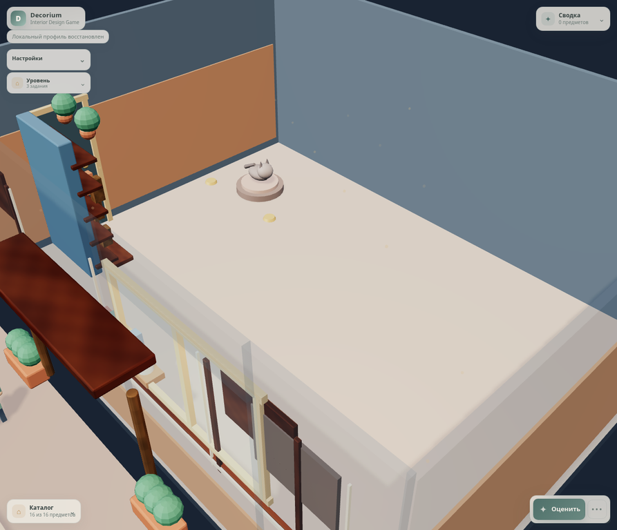

# PROD-018 — ClientBrief source foundation

**Статус:** Completed

**Дата:** 15 августа 2026 г.

**Связанное решение:** [ADR-025](../adr/adr-025-client-brief-source-policy.md)

## Цель

PROD-018 начинает corrective mechanics track после аудита оценки. Слайс делает **versioned `ClientBrief v1` единственным source of truth для текущих требований клиента и evaluation policy**: style target, completion target, composition rules, ergonomics rules, client priorities и spatial preferences больше не дублируются в level topology files.

> Уровень описывает пространство, inventory и presentation. Бриф описывает, **для кого** и **по каким требованиям** это пространство оценивается. UI только отображает уже hydrated brief и не интерпретирует policy.

## Поставленный contract

`data/briefs/client-brief.v1.schema.json` and `data/briefs/client-briefs.v1.json` introduce a strict catalog with one authored brief for each shipped level.

| Brief capability | V1 contract | Current player value |
|---|---|---|
| Client identity | Stable `client.id` and client-facing `displayName`. | Level is framed as a client task rather than a generic style template. |
| Style targets | 1–5 weighted targets with exactly one `primary` and optional `secondary` / `accent` targets. | V1 can author controlled mixing policy data deterministically. |
| Client priorities | Stable IDs, labels and positive relative weights. | Player sees the customer’s priorities in the dashboard. |
| Spatial preferences | `density`, `clearanceMultiplier` and explicit empty-space preference with target ratio and weight. | Client desire for intimate, balanced or open space is authored, reviewable input. |
| Evaluation policy | `styleMode`, completion rule, composition rules and ergonomics rules. | Current evaluator inputs are hydrated exclusively from brief policy. |

The three initial records demonstrate distinct client intent. `brief-intimate-media-002` already declares a weighted Scandinavian/Japandi/eclectic mix, an intimate density preference, `clearanceMultiplier: 0.75`, and a preference to discourage excessive empty space. `brief-open-studio-003` declares an open-space preference and a higher clearance multiplier. These values are deterministic authored inputs, not UI heuristics.

## Source migration and lifecycle

Level files now contain only `id`, name, `clientBriefId`, presentation profile, room dimensions, available items and initial placement. Level schema requires `clientBriefId` and rejects obsolete level-side `styleId`, target stars, composition rules and ergonomics rules.

`JsonClientBriefRepository` validates and caches the catalog with AJV, then returns an isolated deeply frozen clone. `LoadLevelUseCase` resolves the referenced brief, validates the brief in the pure Domain `ClientBrief` value object, rejects unknown or cross-level references, and derives current style ID, completion target, composition and ergonomics inputs from `brief.evaluationPolicy`. The immutable `ClientBrief` travels in `LevelDTO.clientBrief`.

```text
level.clientBriefId → validated ClientBrief repository → ClientBrief Domain value
  → LoadLevelUseCase → LevelDTO.clientBrief + current evaluation inputs
  → GameController dashboard / EvaluateRoomUseCase
```

| Boundary | Ownership in PROD-018 |
|---|---|
| Domain | Validates immutable brief invariants: one primary target, normalized weights, client priorities, spatial preference bounds and completion policy. |
| Infrastructure | Fetches and AJV-validates versioned brief JSON; it does not compose scores or choose a default client. |
| Application | Resolves the explicit level→brief relationship and derives the current evaluator’s existing inputs from the brief. |
| Presentation | Renders client name, title, summary and priorities. It does not calculate style fit, density, clearance or completion. |

## Explicit limits of this foundation

This is a **source migration and contract foundation**, not a hidden claim that multi-style and client spatial policies are already fully evaluated. The existing style evaluator still consumes the primary target’s current constraint catalog. `secondary` / `accent` targets, `clearanceMultiplier`, density and empty-space preference are now durable inputs but become active deterministic scoring channels only in separate corrective slices. This avoids inventing opaque UI behavior or silently changing current score semantics.

The immediately following slices must activate these inputs in this order: spatial truth/layer classification, required functional scenarios, scorecard calibration and completion gates, explainable evaluation UI, then weighted multi-style and client-priority channels. Every activation must begin with a new red contract and keep the brief as its only policy source.

## TDD and verification

| Evidence | Result |
|---|---|
| `ClientBrief` red Domain contract | Initially failed because the value object did not exist. It now validates and freezes complete multi-style/client/spatial/evaluation input. |
| `JsonClientBriefRepository` red contract | Initially failed because no repository existed. It now verifies AJV rejection, one fetch per catalog and isolated immutable brief clones. |
| `ClientBriefContent` red contract | Initially failed because schema, catalog and level references did not exist. It now requires all three shipped levels to resolve complete brief policy and forbids level-side evaluation fallback. |
| `LoadLevelClientBrief` red contract | Initially failed because load ignored `clientBriefId`. It now proves policy hydration, primary-style constraint lookup, completion derivation and rejection of missing/cross-level briefs. |
| Dashboard red contract | Initially failed because client context was invisible. It now proves player-facing client, title, summary and priorities render without policy computation. |
| Full production regression | `npm test` passed **126 files / 407 tests** after the migration. |
| Real-game browser acceptance | Clean `level-001` state rendered Marina and Alexey’s brief and priorities with zero player items; no evaluation, placement, completion or profile mutation occurred. |

## Visual evidence



## Non-goals and follow-up

PROD-018 does not yet change spatial penalties, classify rugs/wall/ceiling layers, activate density or empty-space math, assess secondary/accent targets, mix style scores, add client-specific feedback, or alter progression. Those are intentionally separate systems with their own vertical TDD slices. The next corrective system is **spatial truth foundation**: every catalog item must declare its clearance/passage/layer behavior, allowing a rug under furniture without making furniture stop blocking circulation.

## References

[1]: ../../data/briefs/client-brief.v1.schema.json "ClientBrief v1 schema"
[2]: ../../data/briefs/client-briefs.v1.json "Initial authored ClientBrief catalog"
[3]: ../../src/Domain/Briefs/ClientBrief.js "ClientBrief Domain value object"
[4]: ../../src/Infrastructure/Repositories/JsonClientBriefRepository.js "Validated brief repository"
[5]: ../../src/Application/UseCases/LoadLevelUseCase.js "Brief hydration boundary"
[6]: ../../tests/Domain/Briefs/ClientBrief.test.js "Domain contract"
[7]: ../../tests/Application/UseCases/LoadLevelClientBrief.test.js "Application hydration contract"
[8]: ../adr/adr-025-client-brief-source-policy.md "ADR-025"
